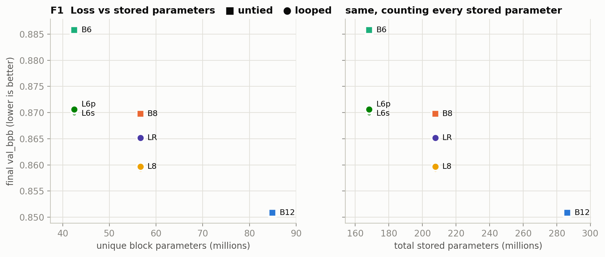
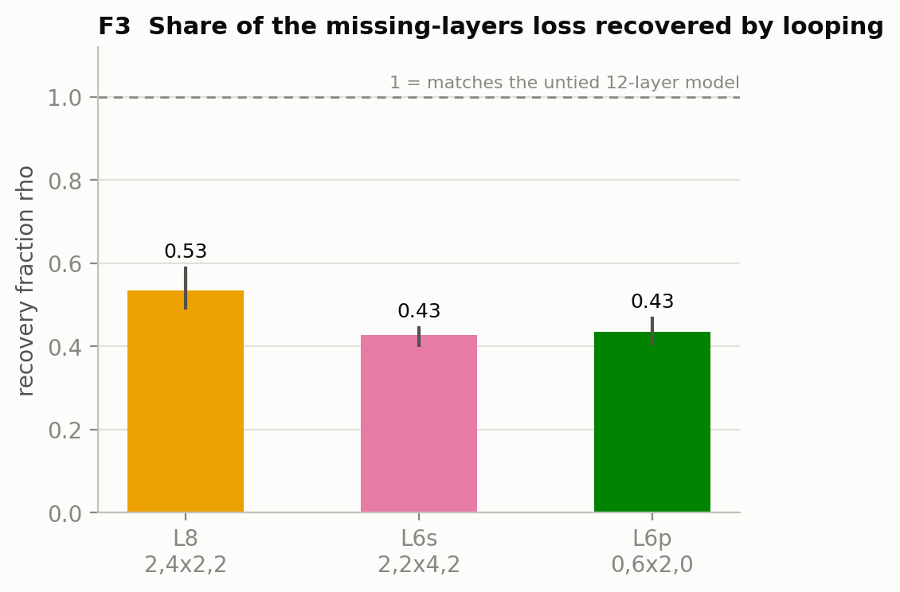
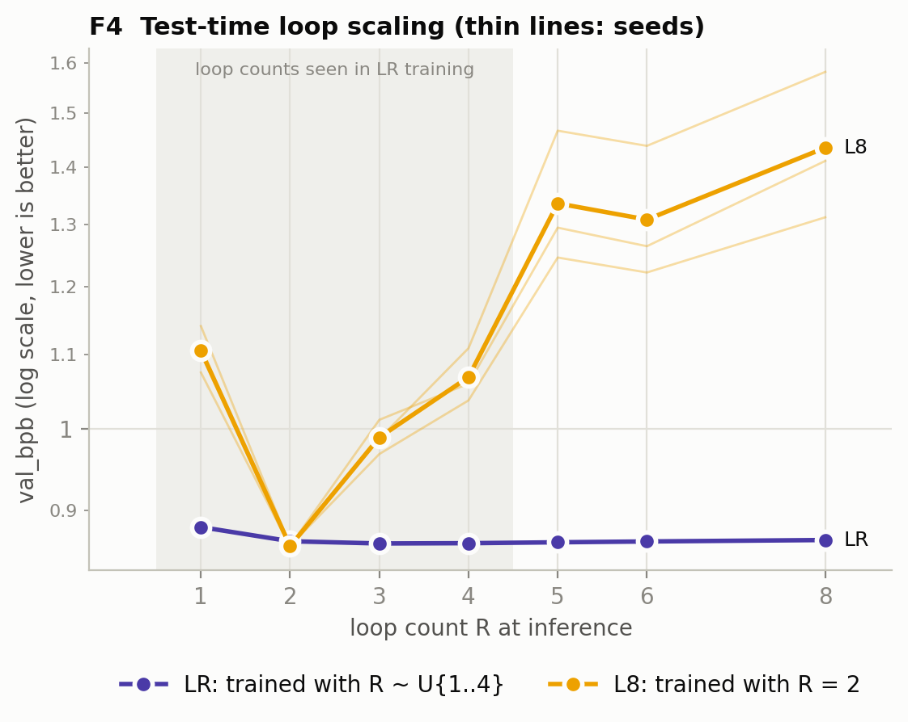
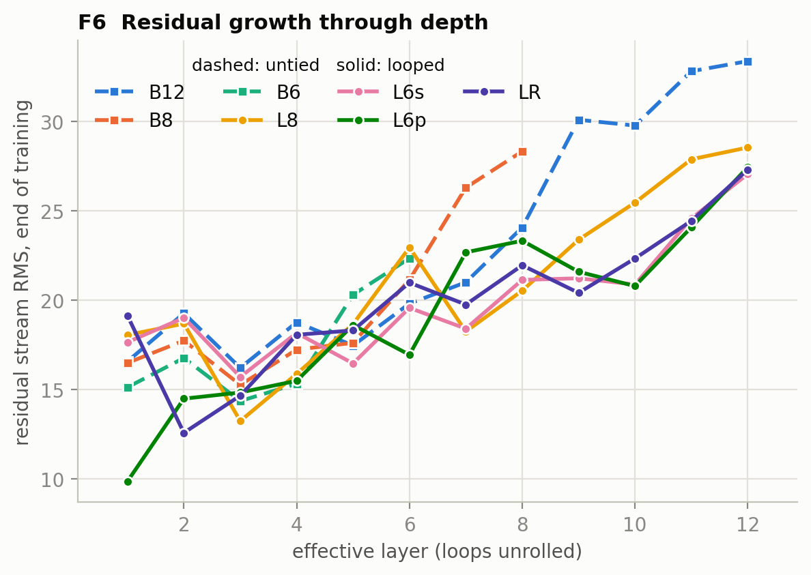

# Weight-Shared Depth in a Modern Small-LM Recipe: A Controlled Comparison of Looped and Standard Transformers in nanochat

**Author:** Neo. **Pre-registration:** [`looped_nanochat_proposal.md`](../looped_nanochat_proposal.md) (git tag `prereg-v1`, 2026-09-20), written before any experiment ran. **Lab notebook:** [`dev/LOOPED_LOG.md`](../dev/LOOPED_LOG.md). **Code, configs, raw results:** this repository, branch `looped`. Every number below is copied from `results/` files produced by the run scripts.

## Abstract

Looped (depth-recurrent) transformers apply a block of layers several times per token, so effective depth exceeds stored parameters. Published evidence for the benefit comes mostly from large training runs or from plain GPT-2-style baselines. We ask how much survives in a heavily tuned small-model recipe, nanochat, which already has per-layer residual scalars, embedding re-injection, value embeddings, a backout subtraction and the Muon optimizer. We ran a pre-registered, single-GPU comparison in which looped and untied models share one width, one data stream (identical token order), one token budget, one batch size and one learning-rate recipe, and differ in nothing but the layer visit schedule. At d12 width (dim 768, 1.32B tokens, 3 seeds per arm), a looped model with 8 unique and 12 effective layers reaches 0.8597 validation bits per byte against 0.8698 for the untied 8-layer model with the same parameters and 0.8509 for the untied 12-layer model with the same compute. Looping therefore recovers 53% of the loss caused by removing four layers (95% seed-combination range 0.49 to 0.59), inside the pre-registered prediction of 0.3 to 0.8. Two layouts with 6 unique layers recover 43% to 44% of the loss of removing six. All three equal-parameter comparisons pass the pre-registered decision rule; the sandwich and pure-loop layouts are indistinguishable. A model trained with a random loop count is robust to the loop count at inference (0.8625 to 0.8665 bpb for R = 2 to 8) but its optimum is R = 3, not the largest trained R, and a model trained at a fixed loop count collapses at any other. A single-seed replication at d20 width (dim 1280, 5.22B tokens) gives the same picture: the looped 12-of-20-layer model beats its equal-parameter control by 0.0107 bpb and recovers 50% of the missing-layers loss. Weight sharing buys parameters, not wall-clock: the equal-compute arms match the 12-layer model's training throughput and peak memory within 3%, and the decode cost per token follows effective depth. None of 49 training runs diverged. All runs, including the learning-rate sweep and a run lost to a power outage, are reported.

## 1. Introduction

A standard depth-N transformer applies N distinct blocks once. A looped transformer stores K distinct blocks and applies some of them R times. The idea goes back to Universal Transformers [1] and ALBERT [2] and has returned as a route to latent test-time compute: recurrent-depth models [3], looped models for reasoning [4], parameter-shared conversions of pretrained models [5, 6], large-scale looped language models [7] and loop-aware residual scaling [8].

Two gaps motivated this study. First, baseline strength: most small-scale looped results use GPT-2-style baselines, and nanochat's GPT is not that. At the pinned commit it has rotary embeddings, QK-norm, ReLU² MLPs, untied embeddings, logit soft-capping, learned per-layer residual scalars (`resid_lambdas`), learned per-layer re-injection of the input embedding (`x0_lambdas`), alternating-layer value embeddings, a bigram "smear" gate, a mid-layer "backout" subtraction and Muon for matrix parameters. Several of these interact with weight sharing; notably `x0_lambdas` already provides the input re-injection that recurrent-depth designs add by hand. Second, accessibility: a clean result reproducible on one workstation GPU, in a harness many people already use, is independently useful.

This is a controlled comparison and partial replication. It claims no new architecture. Its contribution is the control: a looped model here is, provably, the untied model with weights tied across visits and nothing else, and the entire analysis, including the decision rule and the figure set, was fixed before the main runs existed.

## 2. Method

### 2.1 Model

Notation `P,KxR,C` means P unique prelude layers, K unique core layers applied R times, C unique coda layers. Unique depth U = P + K + C, effective depth E = P + K·R + C. The forward pass iterates a visit schedule of unique-layer indices, e.g. `2,4x2,2` gives [0, 1, 2, 3, 4, 5, 2, 3, 4, 5, 6, 7]. Everything that holds parameters is indexed by the unique layer u and shared across visits: the block, its `resid_lambdas[u]` and `x0_lambdas[u]`, and its value-embedding table where the unique layer has one. Everything positional is indexed by the effective index e: the attention window (full context everywhere), the backout tap (the residual after effective layer E // 2, matching stock `n_layer // 2` when there is no looping) and the KV-cache slot (a block sees a different input on every visit, so each visit caches its own K/V). Init, optimizer grouping, loss, smear and soft-cap are untouched. A test (`tests/test_looped.py::test_t3_untied_equivalence`) builds a stock 6-layer model whose layers are loaded with the weights of a `1,2x2,1` looped model and shows identical logits in fp32; another shows each shared weight's gradient equals the sum of its copies' gradients. Looping is exactly weight sharing.

Gradients flow through all visits (full backpropagation, no truncation). No Post-LN block, sandwich normalization, residual scaling or additional injection was added: the only difference between a looped arm and a baseline arm is the visit schedule.

### 2.2 Arms

All arms at d12 width: dim 768, 6 heads, sequence length 2048, nanochat tokenizer (32,768 tokens), full-context attention (`--window-pattern L`), bf16, SDPA attention.

| ID | Layout | U | E | Role |
|---|---|---|---|---|
| B12 | `12` | 12 | 12 | reference baseline (stock nanochat d12) |
| B8 | `8` | 8 | 8 | equal-parameter control for L8 and LR |
| B6 | `6` | 6 | 6 | equal-parameter control for L6s, L6p |
| L8 | `2,4x2,2` | 8 | 12 | main looped model |
| L6s | `2,2x4,2` | 6 | 12 | sandwich layout, heavy sharing |
| L6p | `0,6x2,0` | 6 | 12 | pure loop |
| LR | `2,4xR,2`, R ~ U{1,2,3,4} per step | 8 | 8–20 | test-time loop scaling |

Non-embedding block parameters: 7.08M per unique block (B12 84.9M, U = 8 56.6M, U = 6 42.5M). `wte` and `lm_head` are 25.2M each in all arms. Value-embedding tables are 25.2M each and tied to unique layers (B12 151M, U = 8 100.7M, U = 6 75.5M); they are lookups with no matmul cost and are reported separately throughout. L8, L6s and L6p have exactly B12's FLOPs per token (8.871e8): 12 block visits and 6 value-embedding visits each.

### 2.3 Matching protocol

Every arm trains for 2,520 steps of 524,288 tokens (1.32B tokens), nanochat's compute-optimal horizon for B12 (`target_param_data_ratio = 12`). Batch size, learning-rate batch scaling and weight-decay scaling are derived once from B12 and reused by every arm (`--ref-layout 12`); the training script refuses to run a layout without a reference. The data stream is deterministic and independent of the seed and of the micro-batch size; a SHA-256 of the first 320 rows is logged for every run, and it is identical in all 49 runs. A seed changes parameter initialization only. Training is not run-to-run deterministic on this GPU even for identical seeds (two stock B12 runs differ by 8.6e-5 bpb at the end, Section 3.6), so seed variance as measured includes that floor.

### 2.4 Learning-rate fairness

A shared weight receives a gradient summed over its visits, so the stock Muon `matrix_lr` might be mis-tuned for looped arms. As pre-registered, every arm's `matrix_lr` was swept over {0.5×, 1×, 2×} of stock at 40% of the horizon (seed 0), with the rule that an optimum on a grid edge extends the grid one step. Every arm's optimum was at 2×, the grid was extended to 4× for every arm, 4× was worse everywhere, and **2× was selected for all seven arms** (Appendix A). The optimum is the same for untied and looped arms, so all main-matrix comparisons run at one common `matrix_lr` = 0.04. That 2× also wins for stock B12 is most plausibly a property of the 40% horizon; tuning at a reduced horizon is a stated limitation.

### 2.5 Statistics and decision rule

Three seeds per arm. All individual runs, means and sample SDs are reported. A difference is called **supported** if it exceeds 2× the pooled SD of the two arms and every seed of one arm beats every seed of the other; anything else is **inconclusive**. The recovery fraction of a looped model L with U unique and E effective layers is

ρ(L) = (bpb(B_U) − bpb(L)) / (bpb(B_U) − bpb(B_E)),

reported from arm means with its spread over all 27 seed combinations (an interval over seed combinations, not a confidence interval). Runs are excluded only if they diverge (non-finite loss, or final bpb above the step-500 value); none did. The analysis script that applies these rules (`scripts/looped_analyze.py`) was written and tested on synthetic data before the first main-matrix run finished.

### 2.6 Evaluation

Primary: validation bits per byte on nanochat's validation split, 80 × 524,288 tokens, at the final step and every 250 steps. Secondary: the DCLM CORE score (500 examples per task) at the final step. Tertiary: training tokens/s, peak VRAM and `scripts/infer_bench.py` decode throughput. Loop sweep: val_bpb and CORE at inference R ∈ {1, 2, 3, 4, 5, 6, 8} for LR and, as a control, L8, with the same eval protocol as training so that R = 2 reproduces the in-training numbers. Diagnostics: residual-stream RMS after every effective layer, gradient norm of core vs non-core matrices, and the learned scalars.

### 2.7 Hardware and software

One NVIDIA RTX PRO 6000 Blackwell (96 GB), Ryzen 9, Ubuntu 24.04. nanochat at commit `92d63d4` with torch 2.9.1+cu128. Two deviations from the pinned code apply identically to every arm: FlashAttention-3 loading is gated off on Blackwell (the pinned code selected it and aborted with "no kernel image"), so all attention is PyTorch SDPA; and `uv` is run with `--frozen` throughout. Section 3.6 shows the refactored model reproduces stock nanochat.

## 3. Results

### 3.1 Main matrix (d12, 3 seeds)

| arm | layout | U/E | block params | VE params | val_bpb per seed | mean | SD | CORE | tok/s | peak VRAM |
|---|---|---|---|---|---|---|---|---|---|---|
| B12 | `12` | 12/12 | 84.9M | 151.0M | 0.85060, 0.85094, 0.85108 | **0.85087** | 0.00025 | 0.149 | 266k | 28.8 GB |
| L8 | `2,4x2,2` | 8/12 | 56.6M | 100.7M | 0.86001, 0.85901, 0.86005 | **0.85969** | 0.00059 | 0.149 | 268k | 28.2 GB |
| LR | `2,4xR,2` | 8/8–20 | 56.6M | 100.7M | 0.86493, 0.86523, 0.86529 | **0.86515** | 0.00019 | 0.139 | 265k | 42.8 GB |
| B8 | `8` | 8/8 | 56.6M | 100.7M | 0.87034, 0.86979, 0.86921 | **0.86978** | 0.00057 | 0.137 | 367k | 20.9 GB |
| L6p | `0,6x2,0` | 6/12 | 42.5M | 75.5M | 0.86979, 0.87083, 0.87116 | **0.87059** | 0.00071 | 0.148 | 270k | 27.9 GB |
| L6s | `2,2x4,2` | 6/12 | 42.5M | 75.5M | 0.87129, 0.87066, 0.87057 | **0.87084** | 0.00039 | 0.140 | 270k | 27.9 GB |
| B6 | `6` | 6/6 | 42.5M | 75.5M | 0.88592, 0.88614, 0.88525 | **0.88577** | 0.00046 | 0.129 | 452k | 16.9 GB |

CORE is the seed mean; LR is evaluated at R = 2. 0 of 21 runs diverged. Figure F1 plots the final loss against stored parameters, F2 against training FLOPs, F5 the training curves.

**H1, looping helps at equal parameters: supported, three of three.** L8 beats B8 by 0.0101 bpb (rule threshold 2× pooled SD = 0.0012); L6s beats B6 by 0.0149 (0.0009); L6p beats B6 by 0.0152 (0.0012). Every seed of every looped arm beats every seed of its control; the gaps are 10 to 30 seed SDs.

**H2, sharing has a cost at equal compute: supported.** B12 beats L8 by 0.0088 (0.0009), all seeds. ρ(L8) = **0.534** (seed combinations 0.492 to 0.588, median 0.523), inside the pre-registered prediction [0.3, 0.8]. ρ(L6s) = 0.428 (0.403 to 0.444), ρ(L6p) = 0.435 (0.407 to 0.466). Looping recovers about half of the loss caused by removing four layers and a little over 40% of the loss of removing six (F3).

**H3, layout at fixed parameters and compute: inconclusive.** L6s and L6p differ by 0.0002 (threshold 0.0012) and their seeds interleave. The weak prediction that the sandwich is not worse than the pure loop is neither supported nor contradicted; at U = 6, E = 12 the layout does not matter to the loss. (Descriptively, L6p's residual stream starts differently: with no prelude the first core visit sees the raw embedding, F6.)

A note on effect sizes: the step from B6 to B12 (doubling unique depth at fixed width) is worth 0.035 bpb in this recipe; looping L6 gets 0.015 of it for free in parameters and L8 gets 0.010 of the 0.019 between B8 and B12.

### 3.2 Test-time loop scaling (H4)

The LR arm is trained with R drawn uniformly from {1, 2, 3, 4} at every optimizer step (the same R sequence for every seed) and evaluated at R = 2 in the table above. Its cost relative to L8, which has the same parameters and layout but a fixed R = 2, is 0.0055 bpb at R = 2, 0.0026 at its best R, 13% more training FLOPs (mean E = 14) and 42.8 GB instead of 28.2 GB of training memory.

Mean over 3 seeds at inference loop count R (val_bpb / CORE):

| R | 1 | 2 | 3 | 4 | 5 | 6 | 8 |
|---|---|---|---|---|---|---|---|
| E | 8 | 12 | 16 | 20 | 24 | 28 | 36 |
| LR (trained R ~ U{1..4}) | 0.8811 / 0.129 | 0.8652 / 0.138 | **0.8627** / 0.140 | 0.8630 / 0.143 | 0.8640 / 0.144 | 0.8649 / 0.144 | 0.8665 / 0.143 |
| L8 (trained R = 2) | 1.1056 / 0.066 | **0.8597** / 0.149 | 0.9888 / 0.120 | 1.0685 / 0.085 | 1.3360 / 0.058 | 1.3085 / 0.049 | 1.4352 / 0.038 |

**H4 is split.** (a) Monotone decrease over the trained range R = 1..4: **not supported**, narrowly. For all three seeds val_bpb falls 0.881 → 0.865 → 0.8625 from R = 1 to 3 and then rises by 0.0002 to 0.0004 at R = 4: the optimum of a model trained with R ~ U{1..4} is R = 3, not the largest trained value. (b) R ∈ {5, 6, 8} no worse than R = 4 by more than 0.005: **supported** for all seeds (worst +0.0038 at R = 8). There is no improvement beyond R = 4 (hoped for, not predicted). What the randomized-R model does deliver is robustness: 0.8625 to 0.8665 across R = 2 to 8, a 20-layer to 36-layer effective depth range, all within 0.005 of each other, with CORE flat at 0.14. The fixed-R control shows what that robustness costs to obtain: L8 collapses at any R other than 2 (1.11 at R = 1, 0.99 at R = 3, 1.44 at R = 8, CORE 0.04 to 0.12). Without randomized-R training there is no test-time loop scaling at all in this recipe.

A confound to keep in mind when reading F4: the backout tap sits after effective layer E // 2, so it moves with R (e = 4, 6, 8, 10, 12, 14, 18 for R = 1..6, 8 on this layout), and for LR it moved from step to step during training. The loop sweep varies the backout point together with the loop count. The main matrix is unaffected (E // 2 = 6 for every 12-effective-layer arm).

### 3.3 Larger width (d20, one seed)

Because H1 was supported, the pre-registered confirmation at larger width was run: dim 1280, 10 heads, 5.22B tokens (B20's compute-optimal horizon), batch 1,048,576, 4,980 steps, one seed. The matrix LR was set by a mini-sweep on B_U at 40% horizon (1×: 0.79705 vs 2×: 0.79730, within the pre-set 0.003 band, so stock 1× was used for all three arms). The looped layout `2,8x2,2` has the sharing ratio of L8.

| arm | layout | U/E | block params | VE params | FLOPs/token | val_bpb | CORE | tok/s | peak VRAM | wall |
|---|---|---|---|---|---|---|---|---|---|---|
| B20 (B_E) | `20` | 20/20 | 393M | 419M | 3.240e9 | **0.73817** | 0.245 | 79.6k | 73.6 GB | 19.3 h |
| L12 | `2,8x2,2` | 12/20 | 236M | 252M | 3.240e9 | **0.74908** | 0.242 | 80.3k | 70.8 GB | 19.1 h |
| B12 (B_U) | `12` | 12/12 | 236M | 252M | 2.045e9 | **0.75982** | 0.216 | 125.7k | 46.4 GB | 12.2 h |

The looped model beats its equal-parameter control by 0.0107 bpb, the same sign and nearly the same size as at d12 (0.0101), and the ordering B_E < looped < B_U holds at every one of the 20 evaluations from step 250 on. ρ(L12) = **0.496** against 0.534 at d12: at 5.5× the block parameters and 4× the tokens the recovery fraction did not shrink. With one seed the decision rule cannot be applied; against the d12 seed SDs (0.0003 to 0.0007) and the 1e-4 same-seed floor, a 0.011 gap is roughly 20 SDs. CORE follows the d12 pattern: the looped model is within 0.003 of B_E while its loss sits halfway between the controls.

### 3.4 Efficiency

Training: the three equal-compute looped arms match B12's throughput (266k to 270k tokens/s) and peak memory (27.9 to 28.8 GB) within 3%; B8 is 1.38× and B6 1.70× faster than B12. At d20 the picture is the same (L12 80.3k vs B20 79.6k tokens/s; B12 1.58× faster). Weight sharing buys parameters, not wall-clock. The random-R arm costs 1.5× the peak memory of L8 because its R = 4 steps unroll 20 layers.

Inference (`scripts/infer_bench.py`, seed-0 checkpoints, 2048-token prompt, 256 decoded tokens, greedy):

| arm | U/E | prefill tok/s | decode ms/token (batch 1) | decode tok/s (batch 32) | VRAM at batch 32 |
|---|---|---|---|---|---|
| B12 | 12/12 | 311.7k | 2.54 | 9,652 | 3.28 GiB |
| L8 | 8/12 | 313.3k | 2.58 | 9,654 | 3.08 GiB |
| LR (R = 2) | 8/12 | 313.5k | 2.56 | 9,705 | 3.08 GiB |
| L6s | 6/12 | 318.2k | 2.57 | 9,679 | 2.99 GiB |
| L6p | 6/12 | 313.4k | 2.56 | 9,667 | 2.99 GiB |
| B8 | 8/8 | 406.7k | 1.80 | 13,906 | 2.32 GiB |
| B6 | 6/6 | 475.5k | 1.40 | 17,859 | 1.85 GiB |
| d20 B20 | 20/20 | 150.5k | 4.27 | 3,997 | 9.18 GiB |
| d20 L12 | 12/20 | 150.1k | 4.18 | 3,991 | 8.26 GiB |
| d20 B12 | 12/12 | 223.8k | 2.63 | 6,488 | 5.69 GiB |

Decode cost per token follows effective depth E, not stored parameters: L8 decodes at B12's speed, not B8's, and its KV cache has 12 slots per token, not 8. Where a looped model pays off is memory for weights (L8 stores 56.6M block parameters instead of 84.9M) and, with randomized-R training, the option to trade decode speed for loss at inference.

### 3.5 Diagnostics

Residual-stream RMS through depth at the end of training (F6): the looped arms grow more slowly through their second core pass than B12 through layers 7 to 12 (end values 27 to 29 vs 33 at d12; 58 vs 78 at d20). Gradient norms of core versus non-core matrices stayed within a factor of two of each other in every run. No run showed a loss spike, a non-monotone validation curve, or a gradient-norm spike above 2× its median; the 2× learning rate that the sweep selected was well inside the stable region for looped and untied arms alike. Learned `backout_lambda` at the end of training: 0.34 (B12, d12) and 0.19 / 0.16 / 0.08 (B20 / B12 / L12 at d20). The per-loop residual growth is the quantity the DeepLoop analysis [8] predicts should need a loop-aware residual scale in Post-LN models; in this Pre-norm recipe with learned residual scalars we saw no instability that would motivate one at these depths and loop counts.

### 3.6 The controls behind the numbers

*Phase 0 gate.* The refactored model with layout `12` and stock nanochat with `--depth 12` reached 0.847749 and 0.847663 val_bpb after a full run from the same seed (difference 8.6e-5, gate 0.003), with identical throughput and memory, and their losses agree within 1.3e-4 under `torch.compile` for the first 20 steps. In fp32 the two models are identical to 1e-5 (tests T1, T2).

*Noise floor.* Those two runs are the same model, same seed, same data; they differ only by this GPU's nondeterminism. That floor is 8.6e-5 in val_bpb and 0.0049 in CORE. Every H1/H2 effect is two orders of magnitude above the val_bpb floor. CORE differences below about 0.005, such as L8 = B12 = 0.149 despite 0.009 bpb between them, are not distinguishable from rerunning the same model.

*Accounting.* FLOPs are counted per visit (a shared block costs its matmuls every time it runs), attention and KV cache per effective layer. Under this accounting L8, L6s and L6p have exactly B12's FLOPs per token, which the measured throughput confirms. Value embeddings (lookups) are excluded from FLOPs and reported as their own parameter line.

## 4. Discussion

*What looping buys in this recipe.* At fixed width, adding four untied layers to an 8-layer model is worth 0.019 bpb; adding them as a second pass over four existing layers is worth 0.010. Half of the value of a layer, at this scale, comes from running it, and half from it having its own weights. The fraction was 0.53 at d12 and 0.50 at d20, and 0.43 to 0.44 when six of twelve effective layers are shared. This is a clean estimate precisely because the arms differ in nothing else; the recipe's per-layer scalars, value embeddings and backout were all kept and shared per unique layer, and none of them needed changing for the looped arms to train stably.

*The recipe's depth tricks did not absorb the benefit.* One motivation for the study was that `x0_lambdas` already re-injects the input at every layer and might leave nothing for looping to add. The effect sizes (10 to 30 seed SDs) say otherwise; if anything the sweep suggests looped arms prefer the same, higher learning rate as untied arms rather than a different one.

*Test-time compute.* The result for H4 is more modest than the recurrent-depth literature might suggest. Randomized-R training makes the loop count a free inference-time knob, but the knob's useful range is narrow (R = 2 to 4 within 0.0005 of each other, R = 3 best) and it never beats the fixed-R model of the same size at any R. A model that needs loop-count robustness pays 0.003 to 0.006 bpb for it here. The moving backout tap is a confound specific to this recipe and could be removed in a follow-up by pinning the tap to a unique layer.

*Layout.* With U = 6 and E = 12, sandwich and pure loop are equal in loss. This is a null result at one size; the layouts differ in their first-layer residual statistics (F6), so a difference might appear with more loops or at other widths.

## 5. Limitations and threats to validity

- **Scale.** 42M to 85M block parameters and 1.3B tokens at d12; a single seed at 236M to 393M and 5.2B tokens. The recovery fraction was stable across this range but the range is small.
- **Recipe inheritance.** Every hyperparameter except `matrix_lr` was tuned for untied models. Only `matrix_lr` was re-tuned, at 40% horizon, and the sweep chose the same value for all arms; this biases against looped arms and is the conservative direction for H1.
- **Value embeddings.** They hold more parameters than the blocks at d12 (100.7M vs 56.6M for U = 8) and are tied to unique layers, so arms with fewer unique layers lose lookup capacity as well as block capacity. The pre-registered ablation with value embeddings disabled was not run; ρ should be read as "recovery of block plus lookup capacity".
- **Token budget.** The horizon is compute-optimal for B12, so smaller arms are relatively over-trained. F2 shows the FLOP view.
- **Benchmark floor.** CORE at this scale is 0.13 to 0.15 with a same-seed floor of 0.005; val_bpb is primary for that reason, and H5 (reasoning-like vs recall tasks) is reported descriptively only (Appendix B) because the per-task differences are within noise.
- **Nondeterminism.** bf16 training on this GPU is not run-to-run deterministic; n = 3 seeds with fixed data order understates total run-to-run variance, and the measured seed SDs include the nondeterminism floor.
- **Single dataset, single tokenizer, single hardware target.**
- **H4 confound.** The backout tap moves with R in the loop sweep (Section 3.2).

## 6. Related work

Universal Transformers [1] and ALBERT [2] introduced depth-wise parameter sharing; Subformer and related work studied partial sharing. Geiping et al. [3] scale a prelude/core/coda recurrent-depth model with randomized loop counts to 3.5B parameters and are the source of the layout and the random-R training used here. Saunshi et al. [4] show that a k-layer transformer looped L times nearly matches a kL-layer model on reasoning tasks; our ρ ≈ 0.5 on language modelling loss is a quantitative version of "nearly" in a strong recipe. Bae et al. convert pretrained models to recursive ones with layer-wise LoRA [5] and learn per-token recursion depths [6]; Ouro [7] pre-trains looped language models at scale with learned depth allocation. DeepLoop [8] derives a loop-aware residual scaling for Post-LN looped models; our Pre-norm arms with learned residual scalars did not need one at these depths, which is consistent with their analysis being about Post-LN. Coconut [9] feeds hidden states back as continuous thoughts at the token level, a different axis from depth recurrence. nanochat [10] is the harness.

1. Dehghani et al., *Universal Transformers*, arXiv:1807.03819, 2018.
2. Lan et al., *ALBERT: A Lite BERT for Self-supervised Learning of Language Representations*, arXiv:1909.11942, 2019.
3. Geiping et al., *Scaling up Test-Time Compute with Latent Reasoning: A Recurrent Depth Approach*, arXiv:2502.05171, 2025.
4. Saunshi et al., *Reasoning with Latent Thoughts: On the Power of Looped Transformers*, arXiv:2502.17416, 2025.
5. Bae et al., *Relaxed Recursive Transformers: Effective Parameter Sharing with Layer-wise LoRA*, arXiv:2410.20672, 2024.
6. Bae et al., *Mixture-of-Recursions: Learning Dynamic Recursive Depths for Adaptive Token-Level Computation*, arXiv:2507.10524, 2025.
7. Zhu et al., *Scaling Latent Reasoning via Looped Language Models* (Ouro), arXiv:2510.25741, 2025.
8. Li et al., *DeepLoop: Depth Scaling for Looped Transformers*, arXiv:2607.13491, 2026.
9. Hao et al., *Training Large Language Models to Reason in a Continuous Latent Space* (Coconut), arXiv:2412.06769, 2024.
10. Karpathy, *nanochat*, github.com/karpathy/nanochat, 2025 (commit `92d63d4`).

All arXiv identifiers were checked against arxiv.org on 2026-09-27.

## 7. Reproducibility

Everything is in this repository. `python -m pytest tests` runs the equivalence, KV-cache, causality, accounting, gradient-sharing, data-order, smoke and resume tests (71 tests). `runs/looped_phase0.sh`, `looped_sweep.sh` + `scripts/looped_select_lr.py`, `looped_main.sh`, `looped_loopsweep.sh` and `looped_phase2.sh` reproduce the study in order; every run appends one row to `results/looped_results.csv` (or `looped_loopsweep.csv`) and a JSONL log with its resolved hyperparameters, git hash, curves and diagnostics. `python -m scripts.looped_analyze` regenerates `results/analysis.md` and the figures from those files. All 49 training runs of the study are in the CSV, and the two partial logs of the run lost to a power outage and stopped for the checkpointing change are kept as written.

## Appendix A. Learning-rate sweep (40% horizon, seed 0, final val_bpb; * = selected)

| arm | 0.5× | 1× | 2× | 4× |
|---|---|---|---|---|
| B12 | 0.91583 | 0.90148 | 0.89974* | 0.90668 |
| B8 | 0.92869 | 0.92087 | 0.91726* | 0.92158 |
| B6 | 0.94710 | 0.93285 | 0.93131* | 0.93746 |
| L8 | 0.92722 | 0.91010 | 0.90891* | 0.91405 |
| L6s | 0.93882 | 0.91943 | 0.91904* | 0.92352 |
| L6p | 0.93608 | 0.92238 | 0.91722* | 0.92166 |
| LR | 0.92940 | 0.91730 | 0.91586* | 0.92194 |

The 1× vs 2× gap is small for several arms (L6s 0.0004) and these are single-seed numbers; the pre-registered rule selects by lowest val_bpb and was followed. Too low a learning rate (0.5×) costs the looped arms more than the baselines (L6s +0.019, L8 +0.017 over 1×, vs B8 +0.008). Phase 2 mini-sweep on d20 B_U: 1× 0.79705, 2× 0.79730 (1× selected by the pre-set 0.003-band rule).

## Appendix B. Per-task CORE (centered accuracy, mean of 3 seeds), main matrix

| task | B12 | L8 | B8 | LR | L6s | L6p | B6 |
|---|---|---|---|---|---|---|---|
| agi_eval_lsat_ar | 0.058 | 0.056 | 0.063 | 0.040 | 0.031 | 0.082 | 0.060 |
| arc_challenge | 0.057 | 0.031 | 0.036 | 0.028 | 0.044 | 0.039 | 0.026 |
| arc_easy | 0.424 | 0.413 | 0.372 | 0.396 | 0.385 | 0.412 | 0.354 |
| bigbench_cs_algorithms | 0.444 | 0.441 | 0.450 | 0.432 | 0.426 | 0.442 | 0.441 |
| bigbench_dyck_languages | 0.062 | 0.048 | 0.059 | 0.094 | 0.077 | 0.093 | 0.077 |
| bigbench_language_identification | 0.189 | 0.188 | 0.197 | 0.195 | 0.211 | 0.200 | 0.196 |
| bigbench_operators | 0.097 | 0.108 | 0.113 | 0.092 | 0.102 | 0.098 | 0.111 |
| bigbench_qa_wikidata | 0.266 | 0.269 | 0.230 | 0.262 | 0.209 | 0.237 | 0.206 |
| bigbench_repeat_copy_logic | 0.000 | 0.010 | 0.000 | 0.000 | 0.000 | 0.000 | 0.010 |
| boolq | −0.219 | −0.130 | −0.237 | −0.307 | −0.177 | −0.172 | −0.311 |
| commonsense_qa | 0.123 | 0.113 | 0.136 | 0.128 | 0.084 | 0.133 | 0.185 |
| copa | 0.127 | 0.120 | 0.153 | 0.100 | 0.107 | 0.107 | 0.067 |
| coqa | 0.181 | 0.178 | 0.162 | 0.174 | 0.175 | 0.179 | 0.172 |
| hellaswag | 0.164 | 0.137 | 0.125 | 0.146 | 0.131 | 0.138 | 0.105 |
| hellaswag_zeroshot | 0.159 | 0.166 | 0.135 | 0.151 | 0.140 | 0.154 | 0.116 |
| jeopardy | 0.007 | 0.009 | 0.003 | 0.005 | 0.005 | 0.007 | 0.007 |
| lambada_openai | 0.302 | 0.307 | 0.287 | 0.306 | 0.276 | 0.289 | 0.279 |
| openbook_qa | 0.085 | 0.082 | 0.080 | 0.070 | 0.086 | 0.083 | 0.073 |
| piqa | 0.379 | 0.389 | 0.347 | 0.360 | 0.332 | 0.365 | 0.336 |
| squad | 0.170 | 0.187 | 0.166 | 0.192 | 0.203 | 0.181 | 0.171 |
| winograd | 0.187 | 0.121 | 0.165 | 0.131 | 0.155 | 0.177 | 0.089 |
| winogrande | 0.013 | 0.043 | −0.023 | 0.053 | 0.069 | 0.009 | 0.060 |

H5 (looping's gain over the equal-parameter baseline is larger on reasoning-like than on recall tasks) was pre-registered as exploratory. L8 exceeds B8 on 13 of 22 tasks; the largest gains (boolq +0.11, hellaswag_zeroshot +0.03, arc_easy +0.04, piqa +0.04, bigbench_qa_wikidata +0.04) mix recall-heavy and inference-heavy tasks, and the per-task seed SD is 0.01 to 0.05. No pattern is claimed.

## Appendix C. Deviations from the pre-registration

All are recorded in `dev/LOOPED_LOG.md` with dates; the author approved each before it took effect.

1. FlashAttention-3 gated off on Blackwell (the pinned code aborted); SDPA everywhere, every arm.
2. `--horizon-frac` shortens the step count only; batch size, LR scaling and weight decay stay at their full-horizon values (otherwise the sweep would have tuned under a different recipe).
3. The T4 KV-cache test drives the model with an Engine-sized cache and checks Engine by greedy token match, since Engine exposes tokens, not logits.
4. `ve_gate` FLOPs are counted per visit (exactly equal across the E = 12 arms, not "within 0.5%").
5. Loop-sweep evaluation pinned to the training-time eval protocol rather than `base_eval` defaults.
6. Phase 2 at d20 (the proposal allowed d16 or d20) with a B_U mini-sweep for the matrix LR (the proposal did not specify it).
7. Intermediate checkpoints with exact data-stream replay on resume were added after a power outage during Phase 2; no Phase 2 run ended up needing a resume.
8. The value-embedding ablation and Phase 3 (SFT, chat evals) were not run.

## Appendix D. Compute

Phase 0: two full d12 runs, 3.3 GPU-hours. Phase 1: LR sweep 28 runs, 16.7 h; main matrix 21 runs, 32.4 h; loop sweep 42 evaluations, 9.4 h. Phase 2: mini-sweep 9.8 h; three runs 50.6 h; 10.1 h lost to a power outage. Total about 132 GPU-hours on one RTX PRO 6000, against the proposal's guess of 5 GPU-days for Phase 1 alone: a B12-equivalent run takes 1.62 h here, not 3 to 5.
